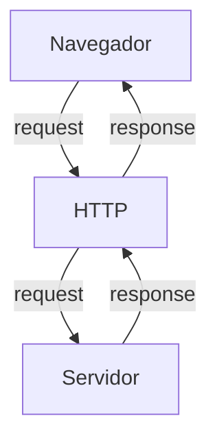
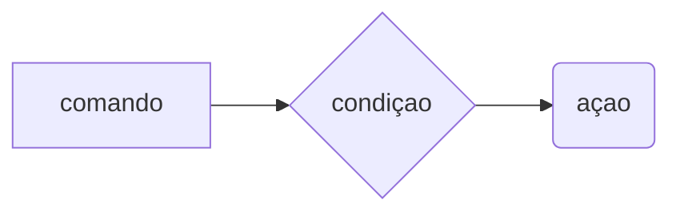

# cUrso backEnd - 225hrs - tecnico em desenvolvimento de sistema -SENAI

profº diogo TB

escola SENAI Americana

2º semestre 2026

## Objetivo do curso

- desenvolver aplicações web server side, utilizando linguagem PHP;
- Aplicar Sintaxe nativa PHP (Vanila);
- manipulação HTTP;
- Persistencia de dados;
- seguranca contra SQL infection/CSRF;
- refatoração emPOO (programaçao orientada ao projeto);
- arquitetura MVC(model, view, controller);
- utilização do frame work Laravel;

obs: framework - um conjunto de bibliotecas que oferecem uma solução completa para desenvolvimento de alguma coisa

## cronograma do semestre

carga Horária: 105h 1º semestre e 120h 2º semestre

duração: 2oh semanais 1º semestre e 20h semanais 2º semestre
--


### semana 1 introdução ao back end e configuração Ambiente PHP

## o que e BackEnd?
O backend (ou "lado do servidor") é a estrutura interna que roda nos bastidores de um site ou aplicativo, sendo responsável pela lógica de negócio, processamento de dados, segurança e armazenamento de informações. Enquanto o usuário interage diretamente com o visual da aplicação (o frontend), o backend processa o que não está visível aos olhos do público externo.Por exemplo, quando você faz login em uma rede social, o frontend exibe o campo para você digitar a sua senha. Ao clicar em "Entrar", o backend recebe os dados, valida se a senha está correta consultando um banco de dados e concede ou não o acesso.Principais Pilares do BackendServidores: Computadores ou sistemas em nuvem que hospedam o código e recebem as requisições enviadas pelos usuários.Banco de Dados: Sistemas onde todas as informações cruciais (como usuários, produtos e históricos) ficam salvas com segurança.APIs (Application Programming Interfaces): Pontes de comunicação que permitem que o backend converse com o frontend ou com serviços externos, como intermediadores de pagamento.Regras de Negócio: A lógica matemática e operacional do sistema, como calcular o frete de um produto ou aplicar um cupom de desconto.Tecnologias e Linguagens ComunsO desenvolvedor backend constrói essa arquitetura utilizando ferramentas específicas, incluindo:Linguagens de Programação: JavaScript (Node.js), Python, Java, C#, PHP e Go.Bancos de Dados Relacionais: MySQL e PostgreSQL.Bancos de Dados Não-Relacionais: MongoDB e Redis.

### o que e http?
- hypertext /transfer Protocol é um protocolo de transferencia de informaçoes da www(Word Widw Web) e em outros sistemas de rede.
ele permite a requisição de respostas de rrecursos  como imagens, arquivos e textos


*HTTP*, Hypertext Transfer Protocol, é um protocolo de comunicação utilizado para transferência de informações na WWW (World wide Web) e em outros sistemas de redes.

O HTTP é a base para que o cliente e um servidor web troquem informações. Ele permite a requisição e a resposta de recurso como, imagens, arquivos e textos.




# aula 2: como funciona  na pratica o backend

**Acao do usuario**: envia uma soliçitação pela UI (interface do usuario). 
### Exemplo:
- tela do celular
- navegador de internet, alexa, IOT...

**enviar uma requisição**: a UI transforma ação do usuario em uma requisição HTTP.

**o processo BackEnd**: o codigo Backend recebe pedido, valida os dados e decide o que fazer. Ex: consultar uma infomacao no BD(Base de Dados).

- **Resposta**: O servidor devolde o resultado para a UI. Ex: Um Login Autorizado, Confirmação de uma Compra...

---
## tipo de requisiçao
os tipos de requisição http indicam a ação que o usuario deseja executar no servidor,  as principais são:

-  **get**: pede dados de um lugar especifico do servidor. "nao faz alterações no servidor"
- **delete**: deleta um dado do servidor
- **post**: envia dados novos para *criar* algo ou processar informações no servidor
- **PUT/PATCH**: Modificar um dados já existente.
---

### iniciando o php

**php** (hypertext preprocessor) e uma linguagem de programação interpretada e open source, focada no desenvolvimento de sistemas para web, pode seu usada junto com html para criação de paginas webv dinamicas.

- o php de fato e uma das linguagens de programação mais populares da atualidade. Ela permite que voce crie aplicaçoes web robustas e muito simplificadas e diretas. a linguagem tem diversos recursos que facilitam e aceleram o processo de desenvolvimento de sites e sistems para web. E além do mais, ela ainda tem um ótimo ecossistema, uma excelente comunidade e um grande mercado de trabalho

##### passo a passo: instalação de php
- fazer o dowload do php (php.net)
- ZIP - nts(non thread safe) 8.5
- Descompactar o Arquivo do PHP na pasta C:src\php (para descompactar usar o 7Zip = melhor) nunca salvar arquivos ou programas na raiz do sistema(C:)

- Adicionar a Pasta do PHP(C:\src\php) as Variaveis de Ambientes di sistema (PATH)
- verificar a instalação rodando o comando
```bash
php --version
```

##### criando minha primeira aplicacao php

1. antes de começar a codar:
- preparar meu VSCODE
- criar um profile proprio para php
- instalar extensoes nacessarias para transformar o VScode em uma IDE:
    - PHP iteliphense =>permite a utililização de Snippets(atalhos de codigo)
    - PHP Debug => ajuda a encontrar os erros de codigo
    - PHP Cs Fixer => formatação de codigo(identação)
    - PHP Server => ajuda na criação de servidor local para PHP
- desabilitamos o php nativo do vscode ( @builtin PPHP)

2. Hello World(muito importante)

#### Estudo sobre VAriaveis e constantes

- declarar variaveis e alocas um espaço na memoria que permite a inclusão e manipulação de dado

**variaveis**

- devem ser declaradas usando "$" antes do nome da variavel;
- sao nao tipadas ( nao precisa declarar o tipo dela na criação),
- podem der string, Numericas (interger e float), booleanas e Nulas. nao permite declaraçao de undefined
- usar o declare(strict_types=1); na primeira linha do arquivo; => blinda o sistema contra conflitos de tipos de variaveis

**constantes**

- não podem ser mudadas ou redeclaradas apos a criaçao
- pode ser criadas usando "const" ou "define"
- não permite interpolação

## estudo de operadores

**aritimeticos**: são realizados para realizas calculos

|operador | nome| exemplo | resultado|
| - | - | - | - |
| + | adição | 10 + 5 | 15 |
|- | subtraçao | 10-5 | 5 |
| * | multiplicação | 10*5 | 50 |
| / | divisão | 10/5 | 2|
| % | modulo(resto) | 10%3 | 1 (10 div 3 da 3 sobra 1)
| ** | expoente | 2**3 | 8(2 elevado a 3)

obs: o operador % e melhor amigo de um programagor, permite ordenar listas e organizar fila e pilhas

**relacionais**:ermite o Relacionamento entre dois ou mais valores, o resultado de uma operação é sempre uma booleana (verdadeiro ou falso).

| operador | significado | exemplo | resultado |
| - | - | - | - |
| > | maior que | 18 > 18 | false |
| >= | maior ou igual a | 18 >= 18 | true |
| < | menor que | 10 < 20 | true |
| <= | menor ou igual | 10 <= 5 | false |
| == | comparacao de valor | "10" == 10 | true |
| === | comparção escrita | "10" === 10 | false |
| != | diferente | "10" != 10 | false |
| !== | estritamente diferente | "10" !== 10 | true | 

**logicos**: permite a combinação entre sentenças.

- operador AND (E) => && : para o resultado set verdadeiro, todas as combinaçoes tem que ser verdadeiras
    - true && true => true
    - true && false => false

-operador OR (OU) => || : para o resultado sert verdadeiro , basta apenas uma condiçao ser verdadeira:
    - false || true => true
    - false || false => false

- operador NOT (não) => ! : inverte a logica da operação,
     - !true => false
     - !false => true

     # semana 3 - Estrutura de Controle de Dados (Condicionais e Repetição)

     - **Conteúdo**: Estrutura `if`, `else`, `elseif`, operadores ternarios, `match` => substituto do `switch/case` , loops `for`, `while`, `do-while` e `foreach`

#### estrutura de controle de dados ajudam no processo de automatização em programa de sistemas

##### condicionais (IF< ELSE,> ELSEIF)
- uso do `if` apenas:
Exemplo: aplicar desconto de 10% em compras acima de 100 Reais;



```php
if($valorcompra > 100)  {
$valorFinal = $valorCompra * 0.9;
}

```