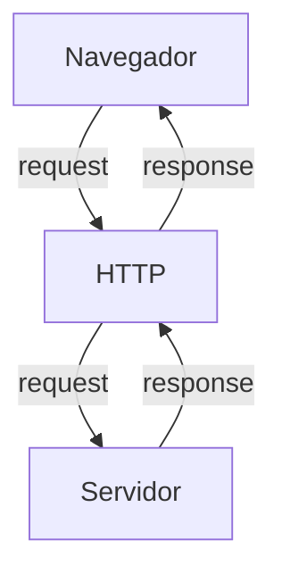
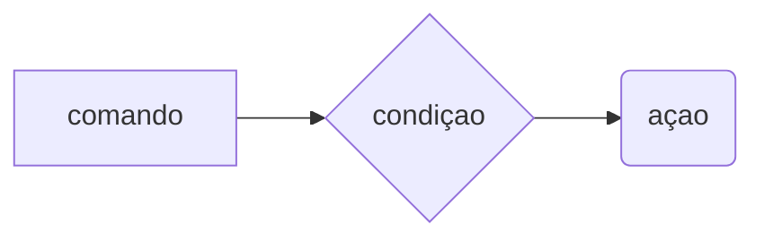
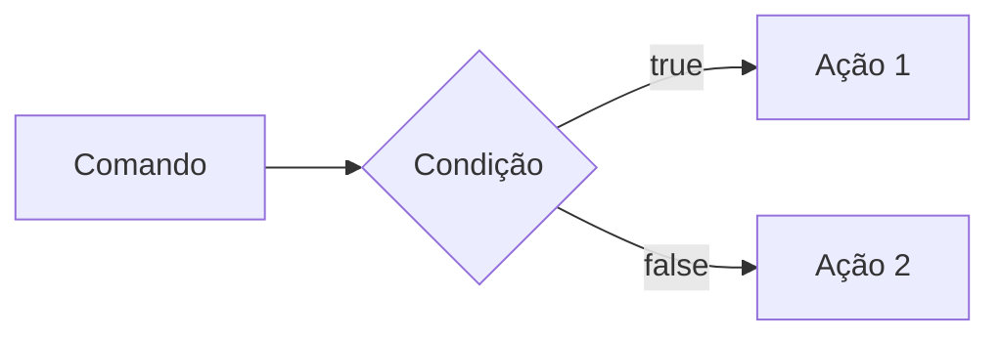
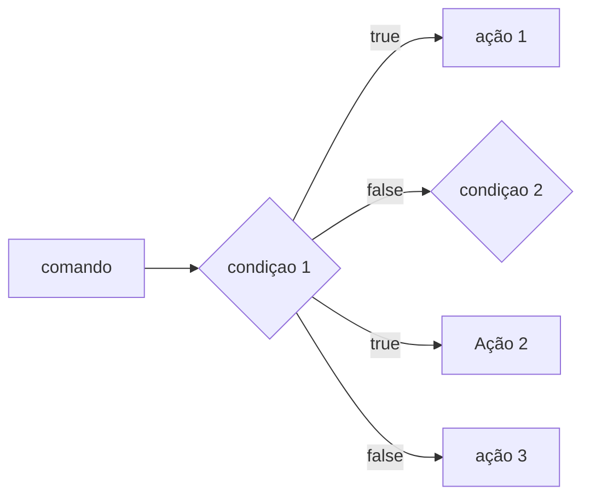
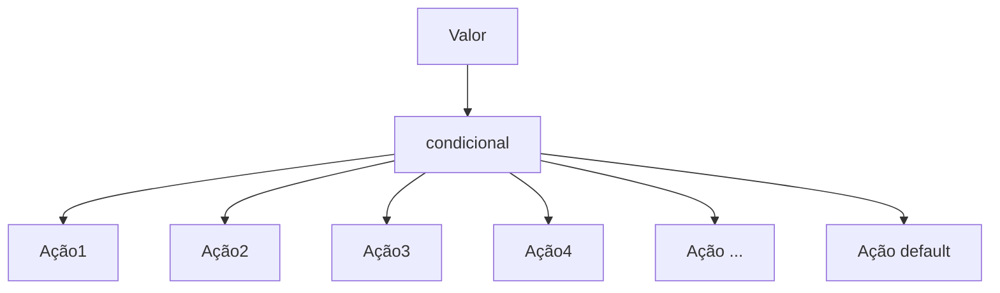
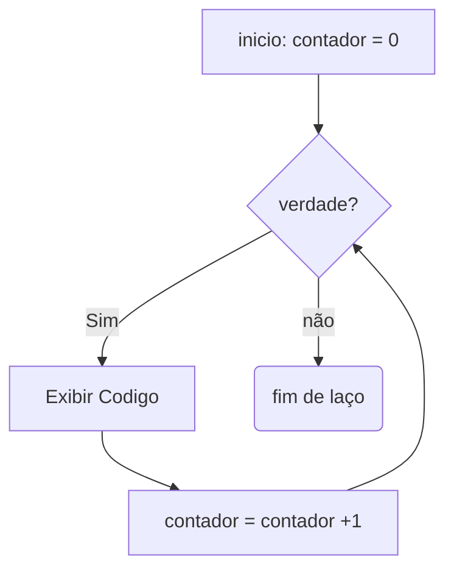
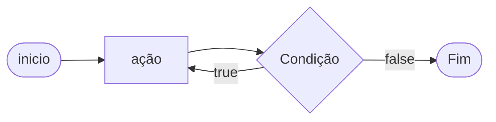
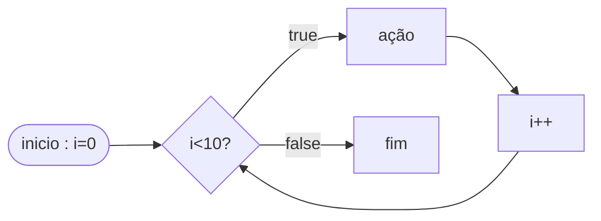

# Curso backEnd - 225hrs - tecnico em desenvolvimento de sistema -SENAI

profº diogo TB

escola SENAI Americana

2º semestre 2026

## Objetivo do curso

- desenvolver aplicações web server side, utilizando linguagem PHP;
- Aplicar Sintaxe nativa PHP (Vanila);
- manipulação HTTP;
- Persistencia de dados;
- seguranca contra SQL infection/CSRF;
- refatoração emPOO (programaçao orientada ao projeto);
- arquitetura MVC(model, view, controller);
- utilização do frame work Laravel;

obs: framework - um conjunto de bibliotecas que oferecem uma solução completa para desenvolvimento de alguma coisa

## cronograma do semestre

carga Horária: 105h 1º semestre e 120h 2º semestre

duração: 2oh semanais 1º semestre e 20h semanais 2º semestre
--


### semana 1 introdução ao back end e configuração Ambiente PHP

## o que e BackEnd?
O backend (ou "lado do servidor") é a estrutura interna que roda nos bastidores de um site ou aplicativo, sendo responsável pela lógica de negócio, processamento de dados, segurança e armazenamento de informações. Enquanto o usuário interage diretamente com o visual da aplicação (o frontend), o backend processa o que não está visível aos olhos do público externo.Por exemplo, quando você faz login em uma rede social, o frontend exibe o campo para você digitar a sua senha. Ao clicar em "Entrar", o backend recebe os dados, valida se a senha está correta consultando um banco de dados e concede ou não o acesso.Principais Pilares do BackendServidores: Computadores ou sistemas em nuvem que hospedam o código e recebem as requisições enviadas pelos usuários.Banco de Dados: Sistemas onde todas as informações cruciais (como usuários, produtos e históricos) ficam salvas com segurança.APIs (Application Programming Interfaces): Pontes de comunicação que permitem que o backend converse com o frontend ou com serviços externos, como intermediadores de pagamento.Regras de Negócio: A lógica matemática e operacional do sistema, como calcular o frete de um produto ou aplicar um cupom de desconto.Tecnologias e Linguagens ComunsO desenvolvedor backend constrói essa arquitetura utilizando ferramentas específicas, incluindo:Linguagens de Programação: JavaScript (Node.js), Python, Java, C#, PHP e Go.Bancos de Dados Relacionais: MySQL e PostgreSQL.Bancos de Dados Não-Relacionais: MongoDB e Redis.

### o que e http?
- hypertext /transfer Protocol é um protocolo de transferencia de informaçoes da www(Word Widw Web) e em outros sistemas de rede.
ele permite a requisição de respostas de rrecursos  como imagens, arquivos e textos


*HTTP*, Hypertext Transfer Protocol, é um protocolo de comunicação utilizado para transferência de informações na WWW (World wide Web) e em outros sistemas de redes.

O HTTP é a base para que o cliente e um servidor web troquem informações. Ele permite a requisição e a resposta de recurso como, imagens, arquivos e textos.




#### aula 2: como funciona  na pratica o backend

**Acao do usuario**: envia uma soliçitação pela UI (interface do usuario). 
### Exemplo:
- tela do celular
- navegador de internet, alexa, IOT...

**enviar uma requisição**: a UI transforma ação do usuario em uma requisição HTTP.

**o processo BackEnd**: o codigo Backend recebe pedido, valida os dados e decide o que fazer. Ex: consultar uma infomacao no BD(Base de Dados).

- **Resposta**: O servidor devolde o resultado para a UI. Ex: Um Login Autorizado, Confirmação de uma Compra...

---
## tipo de requisiçao
os tipos de requisição http indicam a ação que o usuario deseja executar no servidor,  as principais são:

-  **get**: pede dados de um lugar especifico do servidor. "nao faz alterações no servidor"
- **delete**: deleta um dado do servidor
- **post**: envia dados novos para *criar* algo ou processar informações no servidor
- **PUT/PATCH**: Modificar um dados já existente.
---

### iniciando o php

**php** (hypertext preprocessor) e uma linguagem de programação interpretada e open source, focada no desenvolvimento de sistemas para web, pode seu usada junto com html para criação de paginas webv dinamicas.

- o php de fato e uma das linguagens de programação mais populares da atualidade. Ela permite que voce crie aplicaçoes web robustas e muito simplificadas e diretas. a linguagem tem diversos recursos que facilitam e aceleram o processo de desenvolvimento de sites e sistems para web. E além do mais, ela ainda tem um ótimo ecossistema, uma excelente comunidade e um grande mercado de trabalho

##### passo a passo: instalação de php
- fazer o dowload do php (php.net)
- ZIP - nts(non thread safe) 8.5
- Descompactar o Arquivo do PHP na pasta C:src\php (para descompactar usar o 7Zip = melhor) nunca salvar arquivos ou programas na raiz do sistema(C:)

- Adicionar a Pasta do PHP(C:\src\php) as Variaveis de Ambientes di sistema (PATH)
- verificar a instalação rodando o comando
```bash
php --version
```

##### criando minha primeira aplicacao php

1. antes de começar a codar:
- preparar meu VSCODE
- criar um profile proprio para php
- instalar extensoes nacessarias para transformar o VScode em uma IDE:
    - PHP iteliphense =>permite a utililização de Snippets(atalhos de codigo)
    - PHP Debug => ajuda a encontrar os erros de codigo
    - PHP Cs Fixer => formatação de codigo(identação)
    - PHP Server => ajuda na criação de servidor local para PHP
- desabilitamos o php nativo do vscode ( @builtin PPHP)

2. Hello World(muito importante)

#### Estudo sobre VAriaveis e constantes

- declarar variaveis e alocas um espaço na memoria que permite a inclusão e manipulação de dado

**variaveis**

- devem ser declaradas usando "$" antes do nome da variavel;
- sao nao tipadas ( nao precisa declarar o tipo dela na criação),
- podem der string, Numericas (interger e float), booleanas e Nulas. nao permite declaraçao de undefined
- usar o declare(strict_types=1); na primeira linha do arquivo; => blinda o sistema contra conflitos de tipos de variaveis

**constantes**

- não podem ser mudadas ou redeclaradas apos a criaçao
- pode ser criadas usando "const" ou "define"
- não permite interpolação

## estudo de operadores

**aritimeticos**: são realizados para realizas calculos

|operador | nome| exemplo | resultado|
| - | - | - | - |
| + | adição | 10 + 5 | 15 |
|- | subtraçao | 10 - 5 | 5 |
| * | multiplicação | 10 * 5 | 50 |
| / | divisão | 10/5 | 2|
| % | modulo(resto) | 10 % 3 | 1 (10 div 3 da 3 sobra 1)
| ** | expoente | 2 ** 3 | 8(2 elevado a 3)

obs: o operador % e melhor amigo de um programagor, permite ordenar listas e organizar fila e pilhas

**relacionais**:ermite o Relacionamento entre dois ou mais valores, o resultado de uma operação é sempre uma booleana (verdadeiro ou falso).

| operador | significado | exemplo | resultado |
| - | - | - | - |
| > | maior que | 18 > 18 | false |
| >= | maior ou igual a | 18 >= 18 | true |
| < | menor que | 10 < 20 | true |
| <= | menor ou igual | 10 <= 5 | false |
| == | comparacao de valor | "10" == 10 | true |
| === | comparção escrita | "10" === 10 | false |
| != | diferente | "10" != 10 | false |
| !== | estritamente diferente | "10" !== 10 | true | 

**logicos**: permite a combinação entre sentenças.

- operador AND (E) => && : para o resultado set verdadeiro, todas as combinaçoes tem que ser verdadeiras
    - true && true => true
    - true && false => false

-operador OR (OU) => || : para o resultado sert verdadeiro , basta apenas uma condiçao ser verdadeira:
    - false || true => true
    - false || false => false

- operador NOT (não) => ! : inverte a logica da operação,
     - !true => false
     - !false => true

     ### semana 3 - Estrutura de Controle de Dados (Condicionais e Repetição)

     - **Conteúdo**: Estrutura `if`, `else`, `elseif`, operadores ternarios, `match` => substituto do `switch/case` , loops `for`, `while`, `do-while` e `foreach`

#### estrutura de controle de dados ajudam no processo de automatização em programa de sistemas

##### condicionais (IF< ELSE,> ELSEIF)
- uso do `if` apenas:
Exemplo: aplicar desconto de 10% em compras acima de 100 Reais;



```php
if($valorcompra > 100)  {
$valorFinal = $valorCompra * 0.9;
}

```
- uso de `if` e do `else`, 
Exemplo: Aplicar um desconto de 10% para compras acima de 100 reais e 5%para as demais compras


```php
if($valorcompra > 100){
    $valorfinal = $valorCompra * 0.9;
} else {
    $$valorcompra = $valorcompra * 0.95;
}

```

- Uso do `elseif` (if encadeado) => estrutura usada para manipulação de dados em duas ou mais condicionais
exemplo: compras acima de 200 reais tem 15% de desconto, compras acima de 10 reais tem desconto de 10% e os demais tem 5% de desconto



 ```php
if($valorcompra > 200){
    $valorfinal = $valorcompra * 0.85;
} elseif ($valorCompra > 100) {
    $valorFinal = $valorCompra * 0.9;
}
else {
    $valorFinal = $valorCompra * 0.95;
}
 ```

 *obs*: sempre usar `elseif` para situaçoes que precisam de mais de uma condiçao, ou seja, fazer encadeamento, das condiçoes

 -Uso *ERRADO* do if

 ```php
if($valorCompra > 200) {
    $valorFinal = $valorCompra * 0.85;
}
if($valorCompra > 100) {
    $valorFinal = $valorCompra * 0.9;
} else {
    $valorFinal = $valorCompra * 0.95;
}

 ```

##### operadores ternários

- Um atalho para uma estrutura condicional `if/else`, normalmente escrito em um a unica linha de codigo.

`condiçao ? verdadeira : falsa`

- Perfeito para decisões 

Exemplo: verificar se a pessoa e maior de idade (18)

```php
$idade = 20

$status = ($idade >= 18) ? "Maior de idade" : "mMenor de idade";
$status2 = ($idade >= 60) "Idoso" : ($idade >= 18) ? "Adulto" : "Criança" ;

echo $status 
```

#### expressão condicional `match` (PHP 8)

No mercado atual de PHP não se usa mais uma `Switch/Case` para checar valores fixos, usa-se o `match`. Ele compara e retorna diretamente o resultado caso atenda a condiçao.


Exemplo: selecionar o dia da semana a partir de um Nº

```php
$DiaSemanaNum = date("W")

$nomeDiaSemana = match($diaSemanaNum) {
    "0" => "Domingo"
    "1" => "Segunda"
    "2" => "terça"
    "3" => "Quarta"
    "4" => "Quinta"
    "5" => "Sexta"
    "6" => "Sábado"
    "default" => "Dia Inválido"

};

echo "Hoje é : $nomeDiaSemana

```

----

#### LAÇOS DE REPETIÇAO

- um laço de repetiçao faz com que um bloco de codigo rode varias vezes ate que uma condição mande parar

*laços*

- While(enquanto)

verifica se a condiçao e verdadeira ANTES de entrar no laço. ideal quando você nâo sabe exatamente quanta vezes vai rodar o laço 



Exemplo de Aplicação do while: jogo de adivinhaçao de um nº secreto
```php
$numeroSecreto = rand(1,10);

$tentativa = 0;

$numeroEscolhido = 0;

while($numeroEscolhido != $numeroSecreto){
    echo "tente novamente"
    ////vou Escolher outro Nº para adivinhar
    numeroEscolhido = rand(1,10);
    tentativas++;
}

echo "acertou!!! o nº secreto é $numeroEscolhido";

```

- o laço do `while` (faça enquanto)

A diferença é que ele executa o bloco pelo menos uma vez, mesmo que a conduição seja false desde o início, pois ele só pergunta no final.



Exemplo: Jogo de Adivinhação de um nº

```php

$numeroSecreto = rand(1,10);

do{
    $numeroEscolhido= rand(1,10);
    if(numeroEscolhido == numeroSecreto){
        echo "acertou!!!";
        break;
    }
    echo "tente novamente";
} while($numeroEscolhido !+ numeroSecreto);

```


##### o freio de emergência: `break` e `continue`

as vezes precisamos interferir no laço enquanto ele está rodando

- `break`=> **para tudo!** quebra o laço inteiro e vai embora
- `continue` => **continue** Ele igmora o codigo daquela rodada especifica e pula logo para a proxima rodada

Exemplo de Aplicação do Código: Sistema de Controle do Elevador

```php 

for($andar = 1 ; $andar<=10; $andar++){
    if($andar ==4){
        echo "Andar $andar está em obras. Passando direto!";
        continue;
        
    }
    echo "elevador parou no andar $andar"
}

```
---

##### Laço de Repetição `for`

Use o `for`quando você sabe quantas vezes precisa repetir uma ação ou quando precisa controle um contador. Ele possui 3 partes:

- inicialização;
- condição;
- incremento; 

for(inicialização; condição; incremento) {}


Exemplo: Exibir todos os meses do ano:
```php
For($mes=1; $mes<=12; $mes++) {
    echo "mês $mes";

}

```
Nesse Exemplo, `$mes`começa em 1, o laço continua enquantio `$mes`for menor ou igual a 12 e, ao final de cada repetição, `$mes++`aumenta o contador em 1.

#### Laço de repetiçao `foreach`

Use o `foreach` quando precisar percorrer cada item de um *array*. Ele acessaq o elemento diretamente, sem que você precise controlar o contador

Exemplo: imprimir todos os items de um vetor

```php

$frutas = ["Maça", "Banana", "Uva", "Pera"];
foreach($frutas as $fruta){
    echo "Fruta: $fruta";
}
```
Outor exemplo: acessar a chave e o valor de cada item

```php
$preço = [
    "caderno" => 25.90
    "caneta" => 5,50
    "mochila" => 99.00
]; // vetor não ordenado chave => valor

foreach ($preços as $produto => $preço){
    echo "$produto: R$ number_format($preço,2)";
}

```
Desafio: fazer um simulador de cobrança (FINANSENAI)

---

---

### semana 4: modularização com funções

#### principio do DRY ( dont repeat) yourself

se uma logica for escrita duas vezes ou mais dentro de um codigo, essa logica deve virar uma função

#### Funções nativas do PHP

O PHP tem milhares de funções prontas, essas funções são chamadas de nativas.

- **O que é uma função**

Uma função é como uma máquina: vocÊ coloca uma materia prima(parâmetro), ele processa e devolve um produto final

Exemplo de função nativa


```php 

$texto = "senai americana";

//str_replace(busca um pedaço do texto e substitui por outro)
$textoNovo = str_replace("americana","São Paulo",$texto);

//strotoupper
echo strtoupper($textoNovo);// SENAI SÃO PAULO

```

##### Principais Funções Nativas ( Mais Utilizadas )

As funções abaixo já fazem parte do PHP e podem ser chamadas diretamente no código. Observe os parâmetros que cada uma recebe e o tipo de informação que ela retorna.

| Função | Categoria | O que faz | Como usar |
|---|---|---|---|
| `strlen()` | Strings | Retorna a quantidade de caracteres de um texto. | `$tamanho = strlen($texto);` |
| `strtoupper()` | Strings | Converte o texto para letras maiúsculas. | `$resultado = strtoupper($texto);` |
| `strtolower()` | Strings | Converte o texto para letras minúsculas. | `$resultado = strtolower($texto);` |
| `ucfirst()` | Strings | Converte a primeira letra do texto para maiúscula. | `$resultado = ucfirst($texto);` |
| `trim()` | Strings | Remove espaços e quebras de linha no início e no fim do texto. | `$limpo = trim($texto);` |
| `str_replace()` | Strings | Substitui uma parte do texto por outra. | `$novo = str_replace("-", "", $cpf);` |
| `substr()` | Strings | Extrai uma parte do texto a partir de uma posição. | `$inicio = substr($texto, 0, 3);` |
| `explode()` | Strings | Divide um texto e cria um array usando um separador. | `$palavras = explode(" ", $nome);` |
| `implode()` | Arrays | Junta os itens de um array em um único texto. | `$lista = implode(", ", $nomes);` |
| `count()` | Arrays | Conta a quantidade de itens de um array. | `$total = count($produtos);` |
| `in_array()` | Arrays | Verifica se um valor existe dentro de um array. | `$existe = in_array("SP", $estados, true);` |
| `array_push()` | Arrays | Adiciona um ou mais itens ao final de um array. | `array_push($nomes, "Ana");` |
| `array_pop()` | Arrays | Remove e retorna o último item de um array. | `$ultimo = array_pop($nomes);` |
| `sort()` | Arrays | Ordena um array em ordem crescente e reorganiza suas chaves. | `sort($notas);` |
| `array_keys()` | Arrays | Retorna um array contendo as chaves de outro array. | `$chaves = array_keys($produtos);` |
| `number_format()` | Números | Formata um número com casas decimais e separadores definidos. | `$preco = number_format($valor, 2, ',', '.');` |
| `round()` | Números | Arredonda um número para a quantidade de casas informada. | `$media = round($nota, 2);` |
| `max()` | Números | Retorna o maior valor de uma lista ou array. | `$maior = max($notas);` |
| `min()` | Números | Retorna o menor valor de uma lista ou array. | `$menor = min($notas);` |
| `is_numeric()` | Validação | Verifica se o valor é um número ou uma string numérica. | `if (is_numeric($entrada)) { ... }` |
| `isset()` | Validação | Verifica se uma variável existe e não possui valor `null`. | `if (isset($usuario)) { ... }` |
| `empty()` | Validação | Verifica se uma variável está vazia. | `if (empty($pedido)) { ... }` |
| `date()` | Data e hora | Formata uma data ou hora conforme uma máscara. | `$hoje = date('d/m/Y');` |
| `file_exists()` | Arquivos | Verifica se um arquivo ou diretório existe. | `if (file_exists('dados.txt')) { ... }` |
| `file_get_contents()` | Arquivos | Lê todo o conteúdo de um arquivo ou endereço. | `$conteudo = file_get_contents('dados.txt');` |
| `file_put_contents()` | Arquivos | Grava conteúdo em um arquivo, criando-o se necessário. | `file_put_contents('log.txt', $mensagem);` |

**Atenção:** algumas funções modificam o array original, como `sort()`, `array_push()` e `array_pop()`. Já outras retornam um novo valor, como `count()`, `explode()` e `str_replace()`. Em caso de dúvida, consulte a documentação oficial do PHP e verifique o retorno da função.

##### Documentação PHP

[Acesse a doumentação oficial do PHP em português](https://www.php.net/manual/pt_BR/)

Consulte também a [referencia do PHP](https://www.php.net/manual/pt_BR/funcref.php) para pesquisar a sintaxe, parâmetros e os valores por cada função.


---

### Funções customizadas (Criando suas proprias máquinas).

Quando o PHP não tem a funçao que queremos, nos a criamos

**Regra de ouro**: Uma função deve focar em `return`(retornar um valor), e nao imprimir(`echo`).

Veja a diferença neste exemplo:
```php
    function calculartotal($preço, $quantidade){
        return $preço * $quantidade; // a função calcula e rotna o resultado, mas não imprime nada
    }

    $total = calculartotal(25.00,3);
    echo "Total da compra: R$ " . number_format($total, 2, ",", ".");
  //total da compra : R$ 75,00
```
A função `calculartotal` pode ser reutilizada em uma pagina, relatorio ou teste. O `echo` aparece somente fora da função, no momento de representar o resultado ao usuário


##### Padrao de uso corporativo (PHP 8 strict Types)

No mercado de trabalho, exigimos que a função avise exatamente o **TIPO** de dado que ela espera receber e o que ela vai devolver

Isso é chamado de **Tipagem de funções**. Ao declarar os tipos, o codigo fica mais faciç de entender e o PHP condegue identificar alguns erros antes que eles causem problemas maiores no sistema.

os tipos m,ais usados:

* `int`: numero inteiro, `10` ou `1024
* `float`; numrero decimal ou ponto flutuamte `10.50`;
* `string`: texto, como `"maria"`;
* `bool`: valor logico, `true` ou `false`;
* `void`: identifica que a função não devolve nenhum valor;

o tipo deve ser descrito antes do nome de cada parametro e o tipo da função deve ser escrito apos os parênteses precedido por `:` informando o que a função vai devolver.

Exemplo de uso:
```php
function apresentarProduto(string $nome, float $preco): string{
    return "$nome custa R$ $preco";
}
$mensagem = apresentaProduto("caderno", 25.90);
echo mensagem;
//caderno custa R$25.90
```

> **resumo**: os tipos dos parametros documantam as entradas da função, o tipo após `:` documeta a saída da função 

##### o tipo magico : `void`

Seuma funçaõ faz um trabalho interno e **não retorna nada**, dizemos quew o retorno dela é "vazio" (`void`)

Exemplo de funçao sem retorno:

```php
function registroLog(string mensagem): void{
    //apenas salvar em um arquivo de texto, não devolve nenhuma variavel
    file_put_contents("erro.log", $mensagem);
}
```


####  Escopo e Referencia (o segredo da memoria)

##### o  que é Escopo? (A Regra de Las Vegas)

*O que acontece dentro da função, fica na função*. Uma variavel criada fora não existe lá dentro, e uma criada lá dentro morre quando a função acaba.

**Escopo** é o local do programa onde a variavel pode ser armazenada/acessada. Em PHP, uma variável criada fora de uma função pertende ao **escopo global**. uma variável criada dentro de uma função, pertence ao **escopo local**

Exemplo de escopo de variaval:

```php
$nomeSistema = "CRM Senai";//variavel global

function criarMensagem(): string{
    $mensagem = "bem-vindo";
    return $mensagem
}
echo $nomeSistema; //Correto: esta no escopo global
echo criarMensagem(); //Correto: a função devolve sua variável local.
echo $mensagem//incorreto, $mensagem só existe dentro da função, nao é acessada fora da função
```

* como enviar dados em uma função?

A forma mais segura e organizada é enviar os dados por **parametros**. assim, a função nao precisa acessar diratamente, variaveis globais

```php
function saudar(string $nome): string{
    return "ola, $nome"
}
$nomeCliente = "João";
echo saudar($nomeCliente); // Olá, João!
```
Nesse caso, $nomeCliente continua no escopo global mas seu valor é enviado para o para,metro local $nome`. A função recebe uma informação, processa e retorna o resultado

Exemplo incorreto:

```php
$nome =  "joão";
function saudar():string{
    return "Olá, $nome";
}
```
A função `saudar()` não conhece a variavel global `$nome`

> **Resumo:** variáveis protegem os dados internos da função; parâmetros são o caminho recomendado para evitar Erros e enviar Informações, e o `return` é usado para devolver um resultado ao codigo que chamou a função.